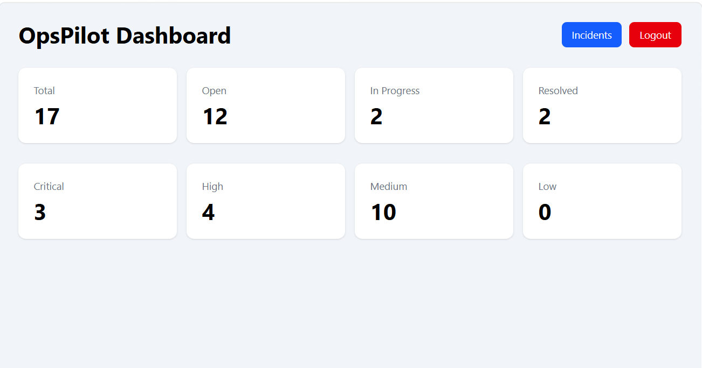
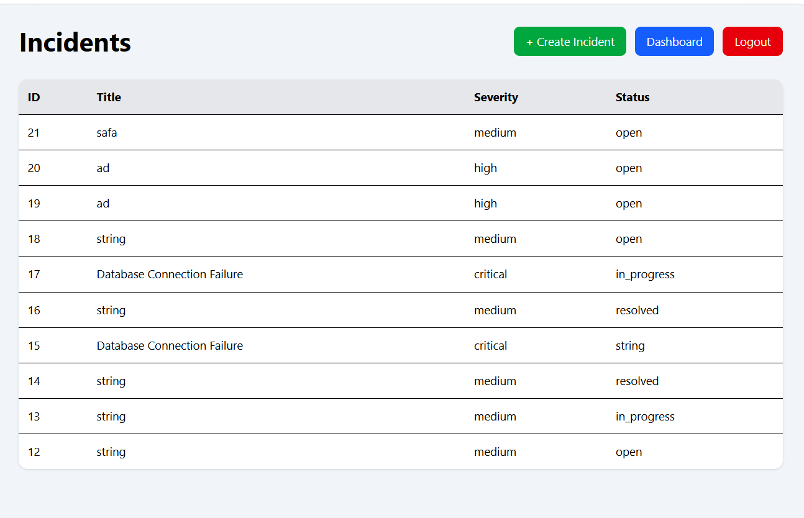
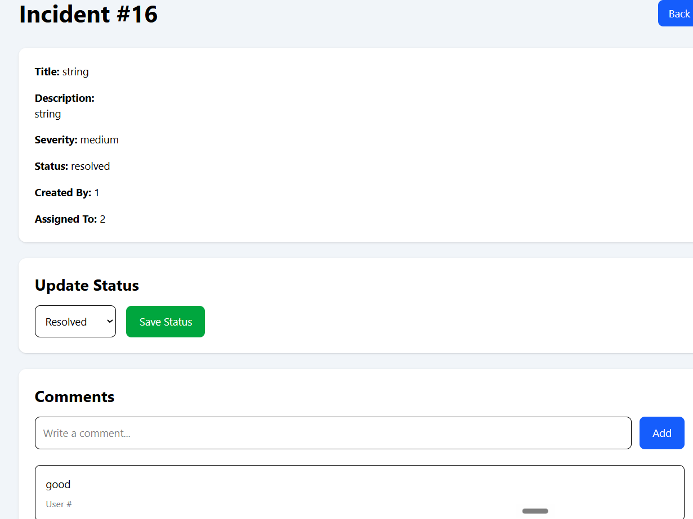
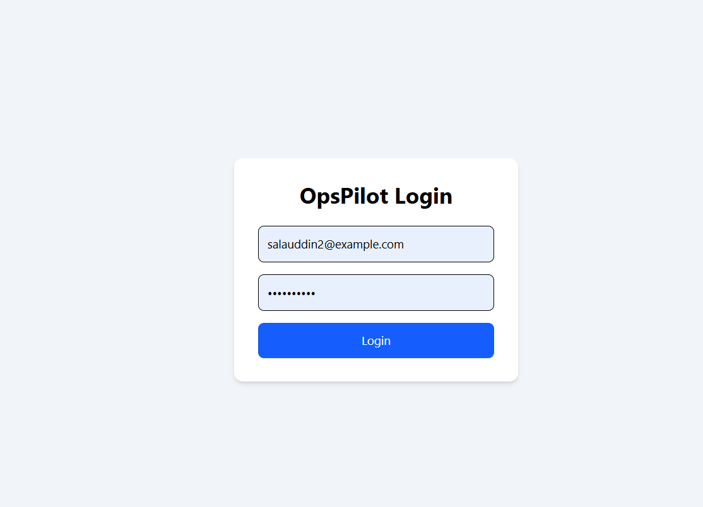
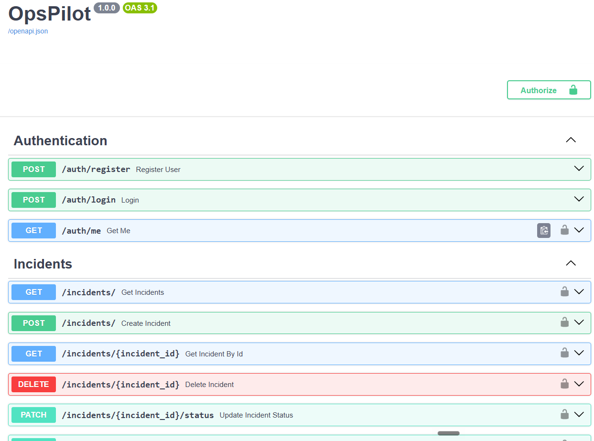

# OpsPilot

OpsPilot is a full-stack Incident Management System designed to help organizations efficiently manage operational incidents. The platform provides secure authentication, role-based access control, incident lifecycle management, dashboards, audit logging, comments, and AI-assisted incident analysis.

The application is built with FastAPI, React, PostgreSQL, Docker, and Docker Compose using a modular architecture suitable for real-world deployments.

---

# Technology Stack

## Backend

- FastAPI
- SQLAlchemy
- PostgreSQL
- Alembic
- JWT Authentication
- Pydantic

## Frontend

- React
- TypeScript
- Tailwind CSS
- Axios
- React Router

## DevOps

- Docker
- Docker Compose
- Nginx

---

# Features

## Authentication

- JWT Authentication
- Role-Based Access Control (RBAC)
- Protected API Endpoints

## Incident Management

- Create Incident
- View Incidents
- Incident Details
- Update Incident Status
- Assign Incidents
- Severity Management

## Dashboard

- Incident Summary
- Status Overview
- Severity Distribution

## Collaboration

- Incident Comments
- Audit Logs

## AI

- AI-assisted Incident Analysis

## API

- RESTful API
- Swagger Documentation

---

# Project Structure

```text
OpsPilot
│
├── backend
│   ├── app
│   ├── alembic
│   ├── requirements.txt
│   └── Dockerfile
│
├── frontend
│   ├── src
│   ├── Dockerfile
│   └── nginx.conf
│
├── docs
│   └── screenshots
│
├── docker-compose.yml
└── README.md
```

---

# System Architecture

```text
                React Frontend
                      │
                      │ REST API
                      ▼
              FastAPI Backend
                      │
          PostgreSQL Database
```

---

# Application Screenshots

## Login



---

## Dashboard



---

## Incident List



---

## Incident Details



---

## Swagger API




## Run with Docker

```bash
docker compose up --build
```

## Frontend

```
http://localhost
```

## Backend

```
http://localhost:8000
```

## Swagger API

```
http://localhost:8000/docs
```

---

# API Modules

- Authentication
- Dashboard
- Incident Management
- Comments
- Audit Logs

---

# Security

- JWT Authentication
- Role-Based Access Control
- Password Hashing
- Protected API Routes
- CORS Configuration

---

# Future Enhancements

- Email Notifications
- File Attachments
- Kubernetes Deployment
- CI/CD Pipeline
- Monitoring with Prometheus and Grafana

---

# Author

**Salauddin**


# License

This project is intended for educational and portfolio purposes.
